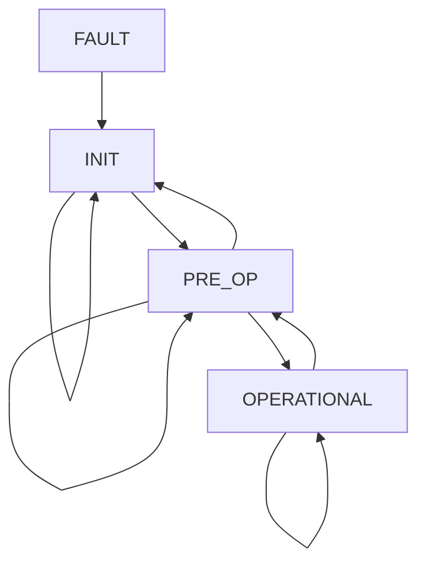

# Fork, by Memoize Labs (V0.0.1.2)

**_Report bugs and get support at contact@memoizelabs.com_**

## Introduction

This documentation defines usage of Memoize Labs' Fork API, an interface to train and use human-like models. 
For real-time interaction with models, we define a state machine that allows for state transitions and ultimately data streaming while handling server-side and client-side faults. 

## Installation
For first-time users, begin by running:
```console 
foo@user:~$ pip install memoizelabs
``` 
For upgrading to the latest version, upgrade to the latest version by running:
```console 
foo@user:~$ pip install --upgrade memoizelabs
```

## Usage

### Methods

```Fork.fork(id, file_paths, isolated_voice_path, description='')```
* **Parameters:**
  * **id** _(str)_: the user-specified ID of the model. 
  * **file_paths** _(str array)_: a string of file paths containing objects to fine tune on. These can be .txt, .mp3, or .mp4 files. 
  * **isolated_voice_path** _(str)_: a path to a .mp3 file containing a clean recording of the target at least 30 seconds in length, used to pre-process submitted files and identify the target's voice within them before finetuning for better results. 
  * **description** _(str, optional)_: a description of the target (ex: An elderly woman with a deep, soothing voice, a British accent, and a witty sense of humor).

```StateMachine.get_state()```
* Returns:
  * The current state of the state machine, one of ```INIT```, ```PRE-OP```, ```OPERATIONAL```, or ```FAULT```.

```StateMachine.get_errors()```
* Returns:
  * Array of errors of type str


### Classes

```Fork(api_key)``` 
* **Parameters:**
  * **api_key** _(str)_: your Memoize Labs Fork API key. Get one at memoizelabs.com/fork

```StateMachine() ``` : A state machine for using real time interactive features with low latency and continous connection to the server.
* **States:**
  * ```StateMachine.INIT (INIT)```: the initialization state of the state machine. The state machine performs initial checks to confirm access to an audio device and wi-fi, then transitions to ```PRE_OP``` if checks pass or ```FAULT``` if an issue is detected. The initialization state checks for:
    * A valid Memoize Labs API key
    * A wi-fi connection
    * An input audio device
    * An output audio device
  * ```StateMachine.PRE_OP (PRE_OP)```: the state machine is ready to begin live streaming of data upon command. 
  * ```StateMachine.OPERATIONAL (OPERATIONAL)```: the state machine is connected and exchanging live streams with the server. 
  * ```StateMachine.FAULT (FAULT)```: the fault state of the state machine. Once the causal errors are resolved, the user must transition the state machine back to INIT state by calling ```StateMachine.transition_state(StateMachine.INIT)``` and initialization checks will be re-run.
 
* **Legal State Transitions:**
  * **States and Transitions**: Each state (```INIT```, ```PRE_OP```, ```FAULT```, ```OPERATIONAL```) is represented as a node, and the arrows (`-->`) represent legal and user-commandable transitions between the states.
  * **Loops**: Transitions where the state remains the same (e.g., `INIT --> INIT`) are included as loops.
  * **Invalid State Transitions**: Invalid transitions result in the state machine transitioning to a ```FAULT``` state, from which it can be recovered back to the ```INIT``` state. 


