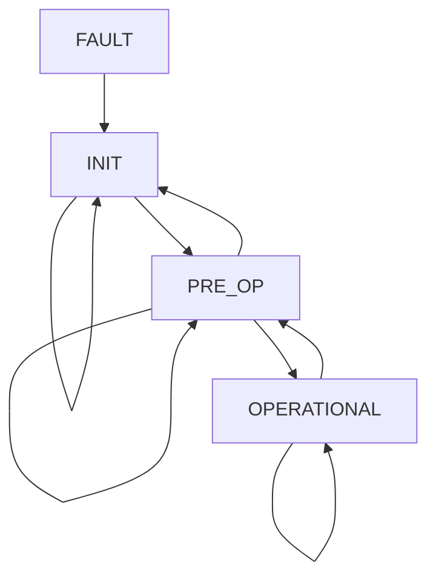

# Fork, by Memoize Labs (V0.0.1.2)

**_Report bugs and get support at contact@memoizelabs.com_**

## Introduction

This documentation defines usage of Memoize Labs' Fork API, an interface to train and use human-like models. 
For real-time interaction with models, we define a state machine that allows for state transitions and ultimately data streaming while handling server-side and client-side faults. 

## Contents

1. [Installation](#installation)
2. [Usage](#usage)
   1. [Classes](#classes)
      1. [Fork()](#fork)
      2. [Fork.StateMachine()](#forkstatemachine)
   2. [Methods](#methods)
      1. [Fork.fork()](#forkfork)
      2. [Fork.StateMachine.init()](#forkstatemachineinit)
      3. [Fork.StateMachine.close()](#forkstatemachineclose)
      4. [Fork.StateMachine.get_state()](#forkstatemachineget_state)
      5. [Fork.StateMachine.get_errors()](#forkstatemachineget_errors)
      6. [Fork.StateMachine.transition_state()](#forkstatemachinetransition_state)


## 1. Installation
For first-time users, begin by running:
```console 
user@foo:~$ pip install memoizelabs
``` 
For upgrading to the latest version, upgrade to the latest version by running:
```console 
user@foo:~$ pip install --upgrade memoizelabs
```

## 2. Usage

### Classes

```Fork(api_key)```: Initialize the Fork class, which contains all applicable methods and subclasses within the API. 
* Parameters:
  * **api_key** _(str)_: Your Memoize Labs Fork API key. Get one at memoizelabs.com/fork.

```StateMachine() ``` : A state machine for using real time interactive features with low latency and continous connection to the server.
* **States:**
  * ```StateMachine.INIT (INIT)```: The initialization state of the state machine. The state machine performs initial checks and then transitions to ```PRE_OP``` if checks pass or ```FAULT``` if an issue is detected. The initialization state checks for:
    * A valid Memoize Labs API key.
    * A Wi-Fi connection.
    * An input audio device.
    * An output audio device.
  * ```StateMachine.PRE_OP (PRE_OP)```: The state machine is ready to begin live streaming of data upon command. 
  * ```StateMachine.OPERATIONAL (OPERATIONAL)```: The state machine is connected and exchanging live streams with the server. 
  * ```StateMachine.FAULT (FAULT)```: The fault state of the state machine. Once the causal errors are resolved, the user must transition the state machine back to ```INIT``` state by calling ```StateMachine.transition_state(StateMachine.INIT)``` and initialization checks will be re-run.
 
* **Legal State Transitions:**
  * **States and Transitions**: Each state (```INIT```, ```PRE_OP```, ```FAULT```, ```OPERATIONAL```) is represented as a node, and the arrows (`-->`) represent legal and user-commandable transitions between the states.
  * **Loops**: Transitions where the state remains the same (e.g., `INIT --> INIT`) are included as loops.
  * **Invalid State Transitions**: Invalid transitions result in the state machine transitioning to a ```FAULT``` state, from which it can be recovered back to the ```INIT``` state. 



### Methods

```Fork.fork(id, file_paths, isolated_voice_path, description='')```: Pass in necessary data for pre-processing and to be placed in a queue for training. 
* Parameters:
  * **id** _(str)_: The user-specified ID of the model. 
  * **file_paths** _(str array)_: A string of file paths containing objects to fine tune on. These can be .txt, .mp3, or .mp4 files, and will be transcribed as necessary and tokenized on the backend. 
  * **isolated_voice_path** _(str)_: A path to an .mp3 file containing a clean recording of the target at least 30 seconds in length, used to pre-process submitted files and identify the target's voice within them before finetuning for better results. 
  * **description** _(str, optional)_: A description of the target (ex: An elderly woman with a deep, soothing voice, a British accent, and a witty sense of humor).

```StateMachine.init()```: Initialize the live inference state machine to the ```INIT``` state.

```StateMachine.close()```: Transition the live inference state machine to the ```INIT``` state, clean up resources, and exit. 

```StateMachine.get_state()```: Get the current state of the live inference state machine. 
* Returns:
  * The current state of the state machine, one of ```INIT```, ```PRE-OP```, ```OPERATIONAL```, or ```FAULT```.

```StateMachine.get_errors()```: Get the set of current errors of the live inference state machine. The returned array should be empty unless the machine is in ```FAULT``` state. 
* Returns:
  * Array of errors of type str.

```StateMachine.transition_state(new_state)```: Transition the state machine from the current state to the requested state. 
* Parameters:
  * **new_state** _(StateMachine state)_: The user-requested state for the state machine, one of ```StateMachine.INIT```, ```StateMachine.PRE-OP```, or ```StateMachine.OPERATIONAL```.


